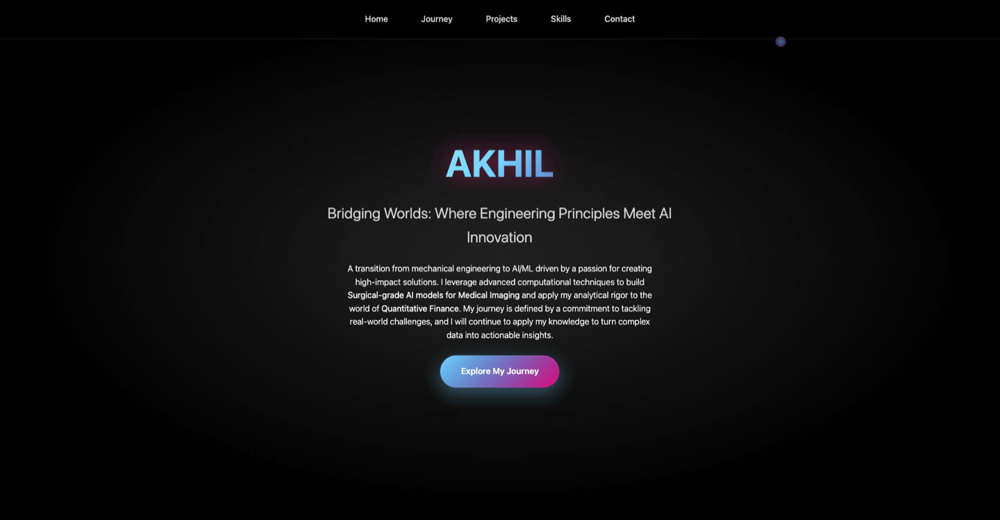

# Interactive Portfolio: Akhil - From Mechanical to AI/ML

Welcome to the repository for my personal portfolio website. This is a fully responsive, single-page site designed to showcase my journey, projects, and skills as I transitioned from Mechanical Engineering to the field of AI/ML. The design is modern, with a dark theme and engaging animations to create a memorable user experience.

### [➡️ View Live Demo](https://akhil717.github.io/your-repo-name/)


---

## Screenshot



---

## ✨ Features

* 🎨 **Modern & Responsive Design:** A sleek, dark-themed UI built with Flexbox and Grid that looks great on desktops, tablets, and mobile devices.
* 🚀 **Smooth Animations:** CSS keyframe animations for the hero section, timeline, project cards, and skills to create a dynamic user experience.
* ⏳ **Interactive Timeline:** An Apple-inspired, alternating timeline that visualizes my academic and professional journey as you scroll.
* 🛠️ **Project Showcase:** A clean grid layout to display key projects, each with a description, technology tags, and custom SVG animations.
* 📊 **Animated Skill Bars:** Visual representation of technical proficiencies that animate into view when they become visible.
* 🔗 **Smooth Navigation:** A fixed navigation bar with smooth scrolling that allows users to easily jump between sections.

---

## 🛠️ Technologies Used

This is a pure front-end project built with foundational web technologies.

* **HTML5:** For the structure and content of the website.
* **CSS3:** For all styling, layout, responsiveness, and animations.
* **JavaScript (ES6):** For DOM manipulation, scroll-based animations, and interactive effects.

No external frameworks or libraries were used, keeping the project lightweight and fast.

---

## 🚀 Getting Started

To run this project locally, follow these simple steps:

1.  **Clone the repository:**
    ```bash
    git clone [https://github.com/your-username/your-repository.git](https://github.com/your-username/your-repository.git)
    ```

2.  **Navigate to the project directory:**
    ```bash
    cd your-repository
    ```

3.  **Open the website:**
    Simply open the `index.html` file in your favorite web browser. That's it!

---

## 📁 File Structure

The repository is structured simply and is easy to navigate.

```
.
├── index.html         // The main HTML file
├── styles.css         // All CSS styles and animations
└── images/            // Folder for all images used
    ├── linkedin.png
    ├── phone.jpeg
    └── ... (other images)
```

---

## 📄 License

This project is licensed under the MIT License. See the `LICENSE` file for details. You are free to fork, modify, and use this project as a template for your own portfolio.

---

## ❤️ Acknowledgments

A big shoutout to Claude for the assistance in development and design!
